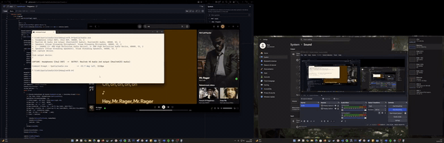

# SpatialAudio — Desktop Audio Spatializer

Turn your desktop into a sound stage: audio is positioned in 3D space based on
where its window sits on your (multi-)monitor setup.

**Portfolio:** [gurkirat.net](https://gurkirat.net) · **Demo post:** [LinkedIn](https://www.linkedin.com/feed/update/urn:li:activity:7496308098668716032) · **GitHub:** [PureChocolate](https://github.com/PureChocolate)

**Stack:** C# / .NET 8 · NAudio · WASAPI loopback · Win32 P/Invoke · from-scratch split-complex FFT · MIT KEMAR HRTF · xUnit + GitHub Actions CI

A C# / .NET learning project. All code written by the learner (me), guided and
reviewed by an AI mentor. Personal study notes are kept out of the repo.

## Status

| Milestone | What it does | Status |
|---|---|---|
| M0 | Capture desktop audio (WASAPI loopback), play it back with low latency | **done** — device menu, capture→playback, latency measurement (2.8/29.4/55.3 ms min/avg/max) |
| M1 | Track focused window position → azimuth/distance across monitors | **done** — Win32 window/monitor tracking, live azimuth readout (front-arc model, ±70° stage) |
| M2 | Spatializer v1: interaural time delay + level panning | **done** — ITD ring-buffer delay + equal-power ILD; audio follows the focused window; direction verified by ear |
| M3 | HRTF: true 3D audio via convolution with measured head filters | **done** — KEMAR HRIR loader; direct-form convolution; from-scratch radix-2 FFT/IFFT + overlap-add; azimuth→HRIR lookup with per-direction crossfade and temporal smoothing; 44.1k→48k IR resampling; audio follows the focused window. xUnit DSP suite (19 tests) |
| M4 | Polish: smoothing, config, standalone .exe | not started |
| M5 (stretch) | Per-app audio routing via virtual cable | not started |
| M6 (stretch) | GUI: window map + speaker positions | not started |

## Requirements

- Windows 10/11
- Visual Studio (Community is fine) with .NET 8 SDK
- **Headphones** (HRTF/binaural only works on headphones)
- Speakers or a second audio device (capture from one, output to the other,
  to avoid the audio feedback loop)

## How to run

1. Open `SpatialAudio.slnx` in Visual Studio, build, Ctrl+F5.
2. Pick a **capture** device (loopback) and a different **output** device —
   headphones; the same device is refused (feedback loop). The captured mix
   streams through the HRTF spatializer to the output, following the focused
   window's position, until you press **Esc**.
3. The HRTF dataset (MIT KEMAR, `data/full/full`, ~1.4 MB) is not in the repo
   — fetch it from https://sound.media.mit.edu/resources/KEMAR/ (full set) if
   it's missing; the loader verifies itself against the published values.

Example: music on the LG monitor speakers → capture that monitor, output to the
Chu2 headphones → you hear the mix spatialized, ~100 ms delayed.

## Tests

`dotnet test` runs the DSP suite: FFT vs the direct DFT, IFFT round-trips,
the convolution theorem, overlap-add vs direct convolution, the HRIR
lookup/crossfade, and the KEMAR loader regression. Tests that need the dataset
skip automatically when `data/` is absent, so CI stays green without it.
